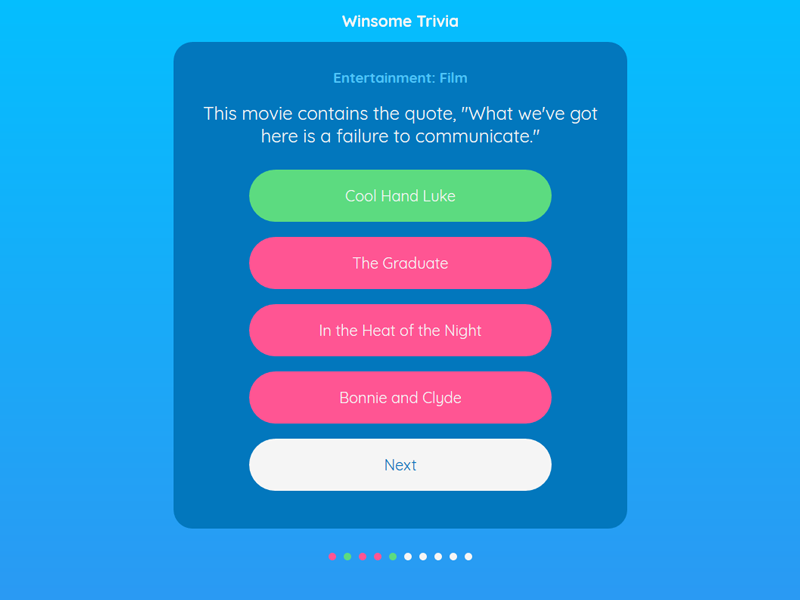

#Trivia Clone

This is a fork  of the SPlode.open-trivia-app

Ror random times a triva application is needed.

See orginal forks for all features and updates.

A single or multiplayer (local) trivia game

<div align="center">
  
</div>

## About
A trivia web app built with Vue.js and powered by local files.

State is managed by [Vuex](https://github.com/vuejs/vuex). Database requests are handled by [vue-resource](https://github.com/pagekit/vue-resource).

## Use

```npm install```
```npm run build```

## License
MIT
